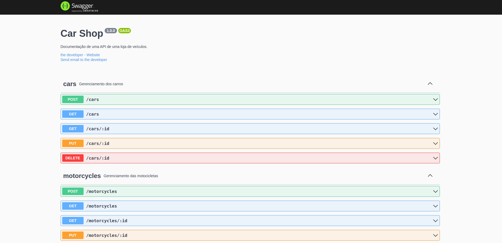

# Car Shop



# Contexto
API com acesso a um banco MongoDb para CRUD de carros e motos.

## Technology 

Here are the technologies used in this project.

* Typescript
* NodeJs
* Express
* Docker
* MongoDB
* Mongoose
* Zod
* Dotenv
* Ts-node
* Chai
* Sinon

## Important

 Typescript config and Dockerfiles made by Trybe.

## Features

The main features of the application are:
 - Create an API of a car shop
 - List, update, create and delete car and motorcycles
 - Application part tests

## Rodando com Docker

 * Clonando o  repositório:

  ```
  git clone git@github.com:DouglasD18/car-shop.git
  cd car-shop
  ```

* Rodando docker-compose
  ```
  docker-compose up
  ```

## Rodando sem Docker

### Instalando Dependências

```bash
npm install
``` 

### Executando aplicação

* Para rodar a API:

  ```
  npm run dev
  ```

* Para rodar os testes da API:

  ```
  npm run test
  ```

Aplicação rodando na porta http://localhost:3001/